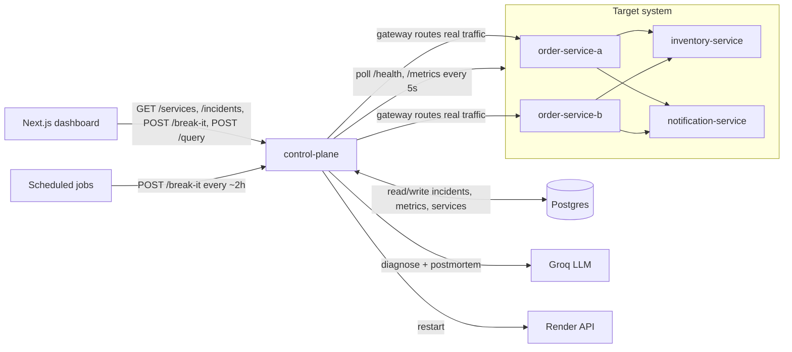
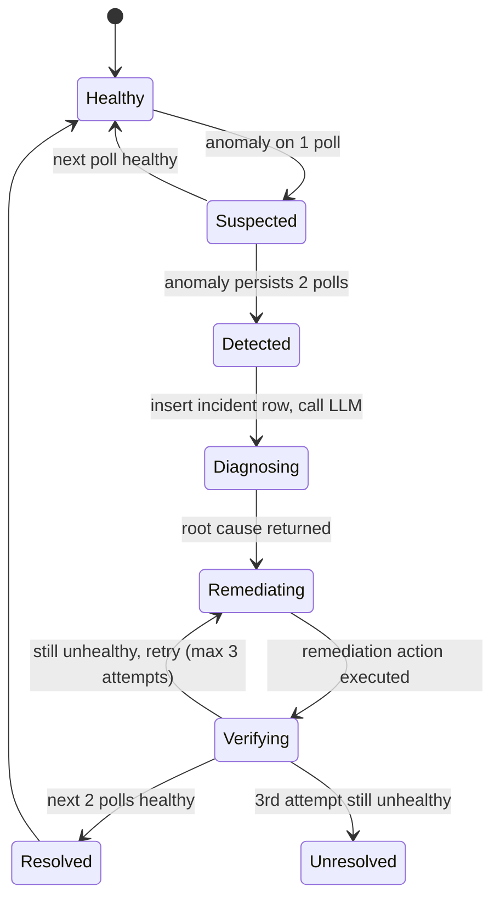

# Autonomous SRE Agent

[](https://github.com/Aditya-tec/SRE-AGENT/actions/workflows/ci.yml)

A self-healing distributed system: three microservices simulating an e-commerce order flow, a control-plane agent that detects, diagnoses via an LLM, and auto-remediates incidents, and a live dashboard with both autonomous background chaos and a manual "Break It" trigger.

**Live dashboard: [sre-agent-eta.vercel.app](https://sre-agent-eta.vercel.app)** — click "Break It" and watch detection → diagnosis → remediation → resolution happen in real time, or just let it sit: a scheduled job injects a random fault autonomously every ~2 hours. API: `https://control-plane-bjmf.onrender.com` ([OpenAPI spec](services/control-plane/openapi.yaml)).

> First load may take up to ~50s — the backend runs on a free tier that sleeps after ~15 min idle. Rare in practice (a keep-alive job pings it every 10 min), not a sign anything's broken.


## Why this exists

Most portfolio projects show "I can build a feature." This one shows what it looks like to automate the response a senior SRE gives when production breaks: detect the anomaly, reason about the likely root cause from telemetry (using an LLM for real diagnostic reasoning, not chat), take a whitelisted remediation action, verify it worked, and write the postmortem — with zero human intervention, but full visibility into every step.

## Architecture





## How it works

1. **Detect** — polls `/health` + `/metrics` on all 4 target services every 5s against simple, explainable thresholds (unreachable, error rate > 30%, p95 latency > 1500ms) — not ML, so the trigger condition is always inspectable. An anomaly must persist for 2 consecutive polls before an incident opens.
2. **Diagnose** — the affected service's recent metrics, plus the same window for its call-chain neighbors, go to an LLM with instructions to name the root-cause service versus downstream symptoms (e.g. order-service's latency rising only because it's waiting on a slow inventory-service, not because it's unhealthy itself).
3. **Remediate** — the recommended action (`restart` / `traffic_shift` / `rate_limit` / `monitor`) executes through a fixed whitelist, weighted by the diagnosis's confidence. `traffic_shift` is real, not simulated — all demo traffic flows through the control plane's own gateway, so flipping the active replica actually redirects live requests.
4. **Verify & report** — 2 consecutive healthy polls close the incident as resolved; persistent failure after 3 attempts closes it as unresolved. Either way, the LLM generates a postmortem from the incident's own timeline and root cause.

## Tech stack

| Layer | Choice | Why |
| --- | --- | --- |
| Services + control plane | Node.js + Express | Minimal boilerplate, one language across the whole system |
| Dashboard | Next.js + React + Tailwind | Fast to scaffold, server-side env vars for the API URL |
| Database | Postgres (Supabase) | Zero server setup, swappable via a storage-driver interface |
| LLM | Groq | Fast inference — matters for a live "watch it diagnose" demo |
| Hosting | Render + Vercel | Free, Git-connected auto-deploy, a REST API for real restarts |
| Logging / metrics | `pino` (JSON) + Prometheus export | Structured logs and a `/metrics` endpoint a real Grafana instance can scrape |

## Safety & security

The single most important property in the whole system: **the LLM only ever picks from a fixed enum of remediation actions** (`restart` / `traffic_shift` / `rate_limit` / `monitor`). It never generates or executes code, shell commands, or arbitrary API calls — its entire output surface is one JSON field constrained to four known strings, executed through a whitelist dispatcher. The same principle extends to the natural-language query endpoint: the completion request sent to the LLM never includes a `tools`/`functions` field, so there's no mechanism for it to invoke anything, even if a question tries to talk it into restarting a service.

Everything else follows from that:

- **Hard attempt cap** — max 3 remediation attempts per incident, then marked unresolved rather than retried forever, with the confidence of the original diagnosis weighting how aggressively it escalates.
- **Idempotent, non-destructive actions only** — nothing in the whitelist can make things worse; safe to call against an already-healthy service.
- **Duplicate-incident and chaos-lock guards** — no double-paging the same outage, no stacking faults from concurrent triggers.
- **Diagnosis never blocks remediation** — an LLM timeout or bad response falls back to a safe default rather than leaving an incident stuck.
- **The gateway can't be pointed anywhere** — target URLs are fixed at startup, never derived from request input, ruling out SSRF by construction.
- **Dead-man's-switch on the poll loop** — overlap guards, per-cycle error isolation, and a `lastPollAt` health signal so an external monitor can catch the poller itself going quiet.
- **Rate limiting + `helmet` on every service**, with a much tighter limit on the fault-injection endpoint specifically.
- **No secrets reach the browser** — verified in CI by grepping the built dashboard bundle for every server-side secret name.
- **Constant-time comparison** for the shared chaos-injection secret, allowlist checks that don't fall through Object prototype pollution, and no raw error messages ever passed through to a client.
- **No authentication, by design** — every read endpoint and the "Break It" trigger are intentionally public; a portfolio demo built to let a stranger click a button needs scope discipline and rate limits, not login walls. Real defense-in-depth here would be solving a problem this project doesn't have.

## Testing & CI

130+ automated tests across all services (Node's built-in `node:test`), covering pure logic (metrics, fault application, anomaly detection), route-level integration tests against real running servers, and the full incident state machine end to end against a stubbed database — including the case where remediation genuinely fails 3 times and the case where it recovers cleanly. CI runs the full suite, a production build, a client-bundle secret-leakage check, and `npm audit` on every push.

## What's next

1. **Organic-vs-injected load distinction** — have traffic occasionally burst with no fault injected, and check whether diagnosis correctly says "this looks like real load, not an incident" instead of false-alarming. The most defensible AI claim available here, since it requires reasoning about the *absence* of a fault.
2. **Historical trend charts** on the dashboard — MTTR over time, not just a running average.
3. **A shareable, read-only postmortem link** for one incident, without the whole dashboard.
4. **Component-level dashboard tests** (the current suite covers logic and visual checks, not React component behavior directly).
5. Real chaos at the infrastructure level (killing a container, not just an in-process flag).

## Local development

No external accounts needed — a pluggable storage driver runs everything on local SQLite with the diagnosis/postmortem fallback paths, which are fully tested in their own right.

```
npm install
npm run install:all
npm run dev:all
```

Boots all 4 backend services + control plane + dashboard together. `npm run seed:demo` populates realistic incident history through the real `/break-it` path. See `npm run gameday`, `npm run load-test`, and `scripts/sre-cli.js` for additional tooling, and [`services/control-plane/openapi.yaml`](services/control-plane/openapi.yaml) for the full API surface (including `/query`, the natural-language status endpoint, and `/metrics`, the Prometheus export).

## Deploying your own copy

This repo is already deployed at the links above — you don't need any of this to see it running. To deploy your own fork:

1. **Local dev**: each service under `services/` has its own `package.json` — `npm install && npm run dev`.
2. **Database**: create a free [Supabase](https://supabase.com) project, run `supabase/schema.sql` once, copy the project URL + `service_role` key into `control-plane`'s env.
3. **Backend**: `render.yaml` is a [Render](https://render.com) Blueprint that deploys all 5 backend services in one pass. Fill in the secret env vars it can't store in the repo (Supabase, Groq, optionally Render API credentials for real restarts).
4. **Dashboard**: deploy `dashboard/` to [Vercel](https://vercel.com) with `NEXT_PUBLIC_CONTROL_PLANE_URL` pointing at your control-plane URL, then set `DASHBOARD_ORIGIN` on the backend to lock CORS down to it.
5. **Scheduling**: any free cron runner (GitHub Actions works well) hitting `/health` periodically and `/break-it` occasionally keeps the demo self-sustaining.
