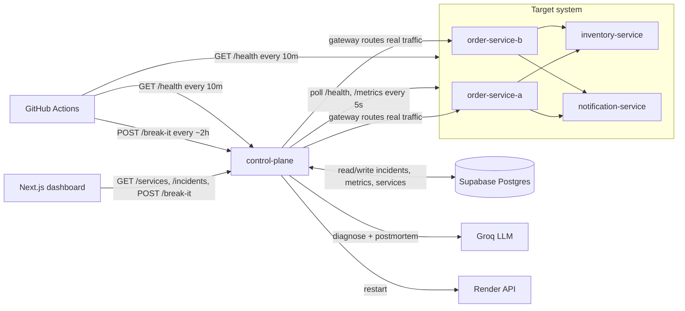
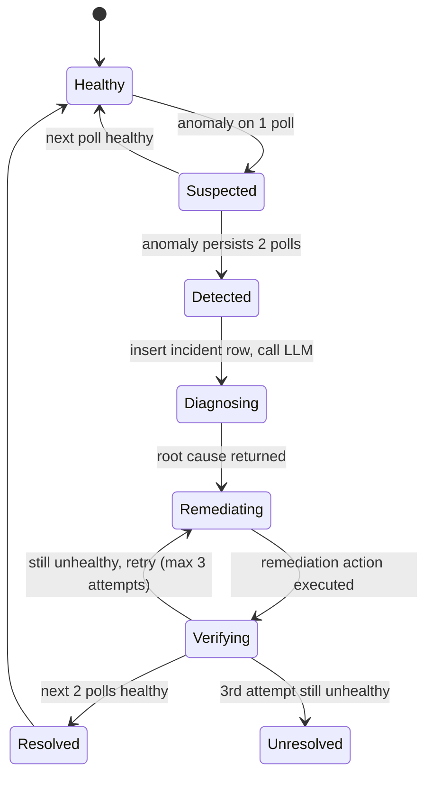
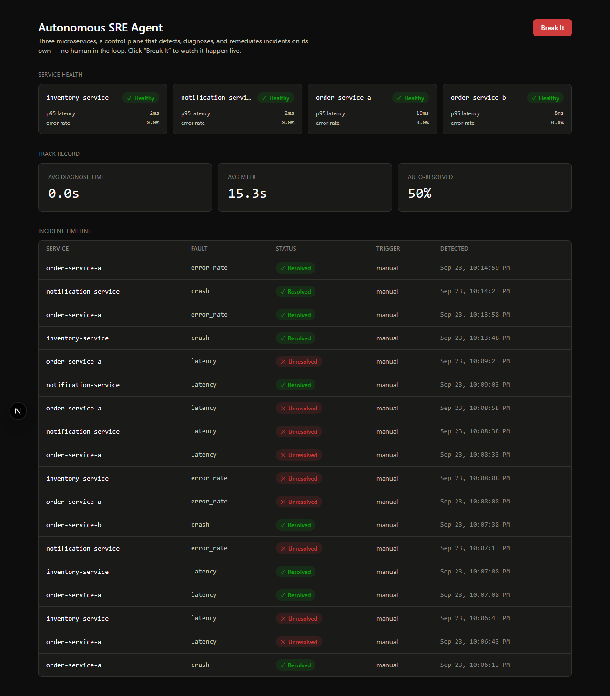
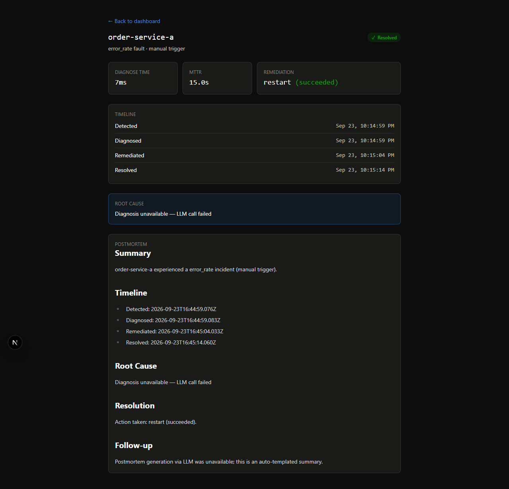

# Autonomous SRE Agent

A fully free-tier, self-healing distributed system: three microservices simulating an e-commerce order flow, a control-plane agent that detects, diagnoses via an LLM, and auto-remediates incidents, and a live dashboard with both autonomous background chaos and a manual "Break It" trigger — deployed on Render, Vercel, and Supabase at zero cost.

**Live dashboard:** _not yet deployed — see [Deployment](#deployment) below. Once live, this line becomes the link and the invitation to click "Break It."_

## Why this exists

Most portfolio projects show "I can build a feature." This one shows what happens when production breaks and what it looks like to automate the response a senior SRE gives: detect the anomaly, reason about the likely root cause from telemetry (using an LLM for real diagnostic reasoning, not chat), take a whitelisted remediation action, verify it worked, and write the postmortem — with zero human intervention, but full visibility into every step.

## Architecture





## Tech stack

| Layer | Choice | Why |
| --- | --- | --- |
| 3 target services + control plane | Node.js + Express | Minimal boilerplate for a handful of endpoints each; keeps the whole system in one language |
| Dashboard | Next.js (App Router) + React + Tailwind | Fast to scaffold, server-side env vars for the control-plane URl |
| Database | Supabase Postgres | Free tier, zero server setup, `@supabase/supabase-js` client |
| LLM | Groq (`llama-3.3-70b-versatile`) | Free tier, fast inference — matters for a live "watch it diagnose" demo |
| Hosting | Render (5 services) + Vercel (dashboard) | Genuinely free web services with no card, Git-connected auto-deploy, a REST API for programmatic restarts |
| Scheduling | GitHub Actions | Free cron for keep-alive pings and autonomous chaos injection |

## Safety guardrails

**The single most important AI-safety property in the whole system: the LLM only ever picks from a fixed enum of remediation actions** (`restart` / `traffic_shift` / `rate_limit` / `monitor`). It never generates or executes code, shell commands, or arbitrary API calls — its entire output surface is one JSON field constrained to four known strings, executed through a whitelist dispatcher (`remediate.js`). This is a deliberate architectural choice, not an accident of scope.

Everything else follows from that:

- **Audit trail first.** `remediation_action` is written to the incident row *before* the action executes, so there's a record even if the action itself fails.
- **Hard attempt cap.** Max 3 remediation attempts per incident. After that, the incident is marked `remediation_success = false` and left in a distinct `Unresolved` state (not silently retried forever) — a real production failure mode most demos don't show.
- **Idempotent, non-destructive actions only.** `restart` and `traffic_shift` are safe to call against an already-healthy service. There is no delete, no scale-down, nothing in the whitelist that can make things worse.
- **Duplicate-incident guard.** Before opening a new incident, the poller checks for an existing unresolved one for that service — the "don't page on-call twice for the same outage" rule.
- **Chaos-in-progress lock.** `POST /break-it` refuses a new trigger with `409` while any incident is still being investigated (`chaosLock.js`), and separately allows only 1 trigger per IP per 5 minutes. Without this, two simultaneous visitors could stack faults on top of each other, or one visitor could keep the demo permanently broken.
- **Diagnosis never blocks remediation.** If the Groq call errors, times out (10s), or returns unparseable JSON, diagnosis falls back to `{rootCause: "Diagnosis unavailable...", recommendedAction: "restart"}` rather than leaving an incident stuck.
- **The gateway can't be pointed anywhere.** `POST /gateway/orders` forwards only to `ORDER_A_URL`/`ORDER_B_URL` — fixed, env-configured at startup — never to a URL derived from request input. This rules out SSRF by construction, not by validation.
- **Dead-man's-switch on the poll loop.** Overlapping `pollAll()` cycles are guarded against (a slow tick can't run concurrently with the next scheduled one — the same mechanism that prevents a double remediation attempt on one incident), every cycle is wrapped in try/catch so one bad tick can't silently kill the `setInterval`, and `GET /health` exposes `lastPollAt` so an external monitor (e.g. UptimeRobot, free) can page if the poller itself ever goes quiet. Without this, the one component watching everything else has nothing watching it.

## Security hardening

This is a public demo with an endpoint whose whole job is to inject faults — the attack surface is worth taking seriously, not hand-waving past:

- **`helmet` + rate limiting on every service.** All 5 backend services set standard security headers and cap requests to 60/min/IP; the control plane adds a much tighter 1-per-5-min/IP limit on `/break-it` specifically (plus the chaos-in-progress lock above), since that's the one endpoint that makes something worse on purpose.
- **`CHAOS_SECRET` gates the fault-injection endpoints.** `POST /chaos` on all 4 target services requires an `x-chaos-secret` header matching a shared secret once one is configured — closes off "anyone with the URL can crash the public demo forever." Left unset, it stays open for local dev. `/chaos/status` (read-only) is never gated. `POST /break-it` on the control plane stays intentionally public (it's the whole point of the demo) but is rate-limited and lock-guarded.
- **Locked-down CORS.** `DASHBOARD_ORIGIN` restricts the control plane's API to the deployed dashboard's origin once set; defaults to open for local dev.
- **Small JSON body limits (10kb)** on every service — these payloads are a few fields, nothing should ever be near that size.
- **Defensive error handling.** Every service has a JSON error-handling middleware (never leaks Express's default HTML/stack-trace error page) and process-level `unhandledRejection`/`uncaughtException` handlers that log instead of silently dying.
- **`npm audit --audit-level=high` runs in CI** for every service on every push — currently 0 known high/critical vulnerabilities across all 5.
- **Secrets never reach the browser.** `SUPABASE_SERVICE_KEY`, `GROQ_API_KEY`, `RENDER_API_KEY`, `RENDER_SERVICE_IDS`, `DISCORD_WEBHOOK_URL`, and `CHAOS_SECRET` only ever live in `control-plane`'s server-side env; the dashboard only ever talks to `control-plane`'s own API. CI builds the dashboard and greps the output for all six names — the build fails if any of them ever show up in client-bundled code.
- **Secrets hygiene, checked.** `git log --all -p` across the full history for every secret env var name turns up only test-fixture placeholder strings (`'dummy-test-key'`, `'s3cr3t'`, etc.) — never a real key, in any commit.
- **`hasOwnProperty`, not the `in` operator, for every user-input allowlist check.** `service in SERVICE_URLS` (control-plane's `/break-it`) and `item in stock` (inventory-service's `/reserve`) both also match inherited `Object.prototype` keys — a request with `"service": "constructor"` or `"item": "toString"` passed the intended allowlist check and went on to index the lookup object with it. Fixed by switching both to `Object.prototype.hasOwnProperty.call(...)`.
- **Constant-time comparison for `CHAOS_SECRET`.** The `x-chaos-secret` check on all 4 target services used a plain `===`, which leaks how many leading bytes matched through response timing. Switched to `crypto.timingSafeEqual` (with an explicit length check first, since it throws on mismatched lengths rather than returning `false`).
- **Bounded query/body inputs.** `/incidents?limit=` is capped server-side (200) instead of trusting whatever a caller passes straight through to the DB; `/chaos`'s `durationSec` is capped at 300s so a malformed or hostile request can't hold a service degraded indefinitely.
- **No raw error messages to the client.** `/incidents` and `/services` returned `err.message` straight from an unexpected DB/driver failure — now logged server-side and replaced with a generic message in the response, so a driver-internal error string is never a caller-visible information leak.

### No authentication, by design

There is no login, no API key, no bot detection, no CAPTCHA anywhere in this system — every read endpoint is public, and `/break-it` is public and unauthenticated on purpose. For a portfolio demo built to let a stranger click a button and watch it work, this is the correct, calibrated call, not an oversight: real defense-in-depth here (accounts, sessions, WAF rules) would be solving a problem this project doesn't have. What actually protects it is scope, not access control — a fixed action whitelist, rate limits, the chaos lock, and read-only telemetry with nothing sensitive in it. Naming that trade-off explicitly, rather than leaving a reviewer to wonder whether it was considered, is the point of this section.

### Known limitations (understood, not mysteries)

- **`chaosState` doesn't distinguish "why" a service is down.** A `crash` fault correctly clears itself on process restart. But if a service happens to crash for an *unrelated* reason (an unhandled exception, a Render redeploy) while a `latency` or `error_rate` fault is still active, that fault silently vanishes along with the process's in-memory state too — there's no way for a fresh process to know a fault was "supposed" to still be running. Acceptable for a demo; a real system would persist active-fault state outside the process.
- **No idempotency key on remediation actions.** `remediate.js` has no explicit guard against a specific `(incidentId, attempt)` pair executing twice — the real protection today is that `poller.js`'s own overlap guard (see Safety guardrails above) prevents the one call path that could have caused that. If a future change adds any external trigger for remediation (a webhook, a retried API call), it should get its own idempotency key rather than relying on that guard.
- **Groq's free-tier rate limit is shared across every simultaneous visitor.** A real traffic spike to the demo could push diagnosis calls into the fallback path more often than the real LLM path. Acceptable — the fallback is safe and honest about itself — but worth knowing if diagnoses look templated during a burst of visitors.

## Testing & CI

90 automated tests across all 5 services (Node's built-in `node:test`, no test framework dependency), covering:

- **Pure logic**: sliding-window metrics (the regression test for a real dilution bug found while building this — see the Phase 4 commit), chaos fault application/auto-clear, anomaly detection + debounce, gateway traffic-shift/rate-limit state, the chaos-in-progress lock, incident-phase derivation.
- **Route-level integration tests**: real Express apps started on ephemeral ports, hit with real `fetch` calls — order flow (including "notification-service unreachable must not fail the order"), inventory reservation edge cases, the `CHAOS_SECRET` gate, `/break-it` validation, trigger-context wiring, and the lock/rate-limit rejection, the `/gateway/orders` replica routing and rate-limit rejection.
- **The full incident state machine**, end to end, against an in-memory stubbed database and real mock HTTP servers: a permanently-down service reaching `Unresolved` after exactly 3 attempts, a service that recovers reaching `Resolved` after 2 healthy polls, the duplicate-incident guard holding under repeated detection cycles, the overlap guard proving a slow cycle is never run twice concurrently, `lastPollAt` advancing each cycle, and the chaos lock releasing once its incident resolves.

`.github/workflows/ci.yml` runs `npm ci`, `npm test`, `npm run build` (dashboard only), a client-bundle secret-leakage check (dashboard only), and `npm audit --audit-level=high` for all 5 services on every push/PR to `main`, plus a YAML-validation job for `render.yaml`, `dependabot.yml`, and the other workflows. `.github/dependabot.yml` additionally checks all 5 `npm` projects plus the GitHub Actions themselves weekly, so CVEs disclosed *after* a deploy get caught too. Run locally: `cd <service> && npm test`.

One real bug this test suite caught while building it, worth naming: `node --test` intermittently hung for minutes after all tests had already passed, because a `fetch()`-based test left an idle keep-alive socket that the test runner's own process-exit detection waited on. Fixed with `--test-force-exit` plus explicit `server.closeAllConnections()` in every test's teardown — a good example of test infrastructure flakiness that looks exactly like a product bug until you isolate it.

## How it works

1. **Detect** — `poller.js` polls `/health` + `/metrics` on all 4 target services every 5s. Anomaly rules are simple, explainable thresholds (unreachable, error rate > 30%, p95 latency > 1500ms) — not ML, on purpose, so the trigger condition is always inspectable. An anomaly must persist for 2 consecutive polls before an incident opens (debounced against a single slow request).
2. **Diagnose** — the affected service's last 12 metric snapshots, plus the same window for its immediate call-chain neighbors, go to Groq with instructions to name a root-cause service versus downstream symptoms (e.g. order-service's own latency rising only because it's waiting on a slow inventory-service, not because it's unhealthy itself) — real cross-service reasoning, not just labeling whichever service tripped the threshold first.
3. **Remediate** — the recommended action (`restart` / `traffic_shift` / `rate_limit` / `monitor`) executes through the whitelist above. `traffic_shift` is real, not simulated: all synthetic and demo traffic flows through the control plane's own `/gateway/orders`, so flipping the active replica actually redirects live requests.
4. **Verify & report** — 2 consecutive healthy polls close the incident as `Resolved`; persistent failure after 3 attempts closes it as `Unresolved`. Either way, Groq generates a postmortem (Summary / Timeline / Root Cause / Resolution / Follow-up) from the incident's own timestamps and root cause.

## What I'd add next

In priority order — the top few are the ones I'd actually do first, not just a wishlist:

1. **Confidence-weighted remediation policy** instead of the flat 3-attempt cap — `high` confidence proceeds immediately, `low` confidence defaults to `monitor` and only escalates if the anomaly persists another cycle. More realistic than a flat cap, and a better interview story.
2. **Organic-vs-injected load distinction** — have the traffic generator occasionally burst (e.g. 5x rate, no chaos injected) and check whether diagnosis correctly reports "this looks like organic load, not a fault" instead of false-alarming. Materially harder and more impressive than anything else on this list — the single most defensible AI claim available here, because it requires the model to reason about absence of a fault, not just pattern-match a threshold breach.
3. **A small chaos scenario library** — named multi-step scenarios (e.g. "cascading failure": `latency` on inventory-service, wait 10s, then `crash` notification-service) instead of 3 flat fault types. Tests the correlated cross-service diagnosis far more convincingly than a single fault ever does.
4. **Historical trend charts** on the dashboard — MTTD/MTTR are currently single running averages; a line chart of MTTR per incident over time is a much better screenshot for a launch post than a static number.
5. **A shareable read-only postmortem link** (`/incidents/:id/share`, no auth needed) for linking one striking incident directly instead of the whole dashboard.
6. **Structured logging** (pino/winston) across all 5 services in place of `console.log`, for a real correlated log trail.
7. **Component-level dashboard tests** (jsdom + testing-library) — the 90 tests cover `lib/` logic and Playwright covers visual/console-error checks; React component behavior itself is still untested.
8. Real chaos at the infrastructure level (killing a container/pod, not just an in-process fault flag) — would need a platform with that primitive on the free tier.
9. More fault types: partial network partitions, slow-DNS, clock skew.
10. Alerting integrations beyond the optional Discord webhook (PagerDuty/Opsgenie-style escalation).

## Status

- [x] Phase 1 — Target services (order, inventory, notification) built and verified locally
- [x] Phase 2 — Deploy target services to Render (render.yaml Blueprint ready)
- [x] Phase 3 — Chaos endpoints
- [x] Phase 4 — Control plane: polling + detection (code complete, needs a live Supabase project to persist)
- [x] Phase 5 — Diagnosis (code complete, needs a `GROQ_API_KEY` to exercise the real LLM call — fallback path verified)
- [x] Phase 6 — Remediation (full state machine verified locally: restart/traffic_shift/rate_limit, retry-to-max-attempts, and recovery-to-Resolved)
- [x] Phase 7 — Postmortem generation (fallback template verified; real Groq output needs `GROQ_API_KEY`)
- [x] Phase 8 — Break-It endpoint + dashboard (built, verified visually with a mock API — needs a live control plane + Vercel deploy)
- [x] Phase 9 — Scheduled chaos + keep-alive (workflows written and YAML-validated; live runs need Actions enabled on the deployed repo)
- [ ] Phase 10 — Polish & metrics (needs a live system running for a day+ to accumulate real MTTD/MTTR numbers)
- [ ] Phase 11 — Documentation & launch (this README is launch-ready except the live link)
- [x] Hardening pass — 90 automated tests, CI (`ci.yml`) on every push/PR, `CHAOS_SECRET` gating, rate limiting, `helmet`, restricted CORS, 0 known high/critical vulnerabilities (see [Security hardening](#security-hardening) and [Testing & CI](#testing--ci))
- [x] Phase 2 hardening — chaos-in-progress lock + tighter per-IP rate limit on `/break-it`, dead-man's-switch on the poll loop (`lastPollAt`, overlap guard, per-cycle try/catch), Dependabot, git-history secrets scan, dashboard client-bundle secret-leakage check in CI (see [Safety guardrails](#safety-guardrails) and [Security hardening](#security-hardening))
- [x] Local dev mode — pluggable SQLite/Supabase storage driver, one-command `npm run dev:all` (no external accounts, no `.env` setup), `npm run seed:demo` populating real incident history end to end, verified against the live API (see [Local dev mode](#local-dev-mode--zero-external-accounts))

Everything through Phase 9 is code-complete and tested as far as possible without external accounts — see each phase's commit message for exactly what was verified locally versus what still needs live Supabase/Groq/Render credentials to exercise for real.

## Local dev mode — zero external accounts

The full detect → diagnose → remediate → resolve loop runs entirely on this machine — no Supabase, Groq, Render, or Vercel account required. Useful for developing against the real system, or for a live walkthrough without waiting on a cloud deploy.

### Pluggable storage driver

`STORAGE_DRIVER` on `control-plane`: `"sqlite"` (local dev) or `"supabase"` (the default — matches every deployed instance today exactly, since existing deploys don't set this var at all). Behind `db.js`, two drivers implement the identical interface (`upsertService`, `listServices`, `insertMetricsSnapshot`, `deleteOldSnapshots`, `getRecentSnapshots`, `getUnresolvedIncident`, `insertIncident`, `updateIncident`, `listIncidents`, `getIncident`) — everything else in the codebase (`poller.js`, `diagnose.js`, `remediate.js`, the routes) is unchanged by which one is active. This is a deliberate dependency-inversion choice: business logic depends on an abstract storage interface, never on Supabase specifically, so swapping the backing store never touches the code that uses it — flipping `STORAGE_DRIVER` back to `supabase` once a real project exists needs no code changes outside `db.js`.

The SQLite driver (`src/db/sqliteDriver.js`, via `better-sqlite3`) mirrors `supabase/schema.sql` with straightforward type translation — `uuid` → `TEXT` (`crypto.randomUUID()`), `jsonb` → `TEXT` (`JSON.stringify`/`parse`), `timestamptz` → `TEXT` ISO strings, `boolean` → `INTEGER` 0/1 — and replicates Supabase's partial-upsert semantics exactly: `upsertService` only `SET`s the columns present in the payload, so the poller omitting `last_seen_at` on an unreachable poll doesn't null out the last-known value. Data lives in `services/control-plane/data/local.db` (gitignored).

### One-command startup

```
npm install           # once, at the repo root — installs concurrently + cross-env
npm run install:all    # once — installs all 5 services + the dashboard
npm run dev:all
```

Boots all 5 backend services + the dashboard together on fixed ports (`order-service-a` 3001, `order-service-b` 3011, `inventory-service` 3002, `notification-service` 3003, `control-plane` 3000, `dashboard` 3006), with `STORAGE_DRIVER=sqlite` and no `GROQ_API_KEY` — diagnosis and postmortem generation exercise their real, already-tested fallback paths rather than requiring a Groq key. No `.env` files needed for this mode; every var `dev:all` needs is set inline by its own npm scripts.

The 4 target services run under `scripts/supervise.js`, a minimal stand-in for Render's auto-restart (nothing else on a local machine brings a crashed process back). It waits 12 seconds before restarting a crashed service — deliberately longer than 2 poll cycles (10s), which matters: an earlier 1-second restart delay let the supervisor bring a service back *faster than the poller could ever see it down*, so some `crash` faults were silently missed by detection entirely. 12s reliably gives the poller's debounce at least 2 down-polls to work with, while still recovering far faster than Render's real ~30-50s cold start.

### Seeding realistic demo data

```
npm run seed:demo
```

Runs `scripts/seed-demo.js`: the full 4-service × 3-fault-type matrix (12 scenarios) back-to-back against the running stack, through the real `POST /break-it` path — the same one the dashboard's Break-It button and the scheduled GitHub Action use, respecting the chaos-in-progress lock rather than bypassing it. Expect several minutes total: each scenario waits for its *own* new incident to actually resolve (verified against real incident rows, not just "nothing is currently unresolved" — that check is vacuously true before anything has even been detected, which silently masked several real bugs found and fixed while building this) before moving to the next. A `latency`/`error_rate` fault genuinely can't be fixed by "restart" in local dev (there's no process for it to kill), so it may cycle through a couple of detect → exhaust-3-attempts → cooldown rounds before its own duration timer clears it — a known, honest limitation, not a hidden failure. Afterward the dashboard has a real, populated incident history with genuine MTTD/MTTR/success-rate numbers instead of an empty first-load state.

Three real, non-obvious bugs surfaced and got fixed while building this local-dev path — worth naming since they're the kind that only show up under sustained, repeated chaos rather than a single manual test:

- The synthetic traffic generator awaited each request's full completion before scheduling the next — during a latency fault, that self-throttled it to roughly one request per fault duration, starving the very anomaly it exists to make detectable. Fixed by firing on a fixed schedule regardless of in-flight requests (matching how real traffic behaves).
- `order-service`'s own timeout calling `inventory-service` (5000ms) was set exactly at chaos's max latency delay (also 5000ms) — a real race where the caller could abort before the callee ever finished, so the callee's own metrics never recorded the slow request at all. Fixed by giving the caller comfortable headroom (8000ms).
- The anomaly detector's debounce counter is independent of the incident tracker and never reset on its own — so a fault that outlived its 3 remediation attempts (which fail fast, since "restart" can't fix it locally) reopened a *new* incident on the very next poll, before the underlying problem had any chance to actually clear. Fixed with an explicit debounce reset on every incident resolution.

### Verified

`npm run dev:all` reliably brings up all 6 services and stays stable; `npm run seed:demo` run against it end to end, confirmed via the real API (not just script output) that genuine incidents open, get diagnosed (fallback path), remediated, and reach `Resolved` or `Unresolved` — including the correlated-diagnosis case (a fault on `inventory-service` also opening a downstream-symptom incident on `order-service-a`). One full local run: 10/12 scenarios fully resolved within the script's observation window, 18 total incidents recorded (the extra 6 are correlated downstream-symptom incidents, not failures of the seeding logic), all 18 reached a terminal state, split roughly evenly between `Resolved` (crash faults, which `restart` genuinely fixes locally) and `Unresolved` (latency/error_rate faults, which `restart` can't fix without a real process to kill — an honest, expected limitation of local dev, not a bug).

Fresh dashboard screenshots taken against this real local run, not a mock:





## Deployment

Deploying requires five free accounts: GitHub (existing), [Render](https://render.com), [Vercel](https://vercel.com), [Supabase](https://supabase.com), and [Groq](https://console.groq.com) — all sign up with GitHub, no card needed. Do them in this order:

### 1. Local development

Each service under `services/` has its own `package.json`. Copy `.env.example` to `.env` and run:

```
npm install
npm run dev
```

Order flow: `order-service` (port 3001) → `inventory-service` (port 3002) → `notification-service` (port 3003). Each service also exposes `POST /chaos` (`{"type":"latency"|"error_rate"|"crash","durationSec":30}`) and `GET /chaos/status`.

```
curl -X POST localhost:3001/orders -H "Content-Type: application/json" -d '{"item":"blue-mug","quantity":2}'
```

`services/control-plane` polls all 4 target services every 5s, writes to Supabase, and opens an incident once an anomaly persists for 2 consecutive polls. It requires `SUPABASE_URL`/`SUPABASE_SERVICE_KEY` to start (see below) and defaults its target URLs to `localhost:3001/3011/3002/3003` for local dev (3011 is where a local `order-service-b` would run, e.g. `PORT=3011 REPLICA_ID=b npm run dev`).

On startup it also runs a synthetic traffic generator (a random order every 1-2s through its own `POST /gateway/orders`) so the anomaly detector always has real request volume to measure against, and the incident state machine described above.

### 2. Supabase

1. Create a free project at [supabase.com](https://supabase.com).
2. In the SQL editor, run [`supabase/schema.sql`](supabase/schema.sql) once — creates `services`, `incidents`, `metrics_snapshots`.
3. From Project Settings → API, copy the **Project URL** and the **`service_role` secret key** (not `anon`) into `control-plane`'s `SUPABASE_URL`/`SUPABASE_SERVICE_KEY`. The `service_role` key must stay server-side only — never expose it to the dashboard.

### 3. Render (5 backend services)

`render.yaml` at the repo root is a Render **Blueprint** that deploys all 5 services (`order-service-a`, `order-service-b`, `inventory-service`, `notification-service`, `control-plane`) in one pass — `order-service-a`/`-b` share the same `services/order-service` source, differing only by the `REPLICA_ID` env var.

1. [Render dashboard](https://dashboard.render.com) → **New** → **Blueprint**.
2. Connect the `Aditya-tec/SRE-AGENT` GitHub repo (authorize Render's GitHub app the first time).
3. Render detects `render.yaml` and shows all 5 services to create. Confirm and deploy.
4. Once live, each service gets a URL of the form `https://<service-name>.onrender.com`. **Verify these match** what's hardcoded in the blueprint's `INVENTORY_URL`/`NOTIFICATION_URL`/`ORDER_A_URL`/`ORDER_B_URL` values — if Render appended a suffix (name collision), update the affected env vars in the dashboard and redeploy.
5. `control-plane` has several env vars marked `sync: false` (secrets Render won't store in the repo) — fill these in manually in the dashboard after first sync: `SUPABASE_URL`, `SUPABASE_SERVICE_KEY` (from step 2), `GROQ_API_KEY` (from console.groq.com), `RENDER_API_KEY` + `RENDER_SERVICE_IDS` (Render account settings → API Keys, then a JSON map of service name → Render service id for the restart API), `DISCORD_WEBHOOK_URL` (optional), `DASHBOARD_ORIGIN` (fill in after the Vercel deploy below).
6. **`CHAOS_SECRET`** (recommended): pick any random string and set it as the *same* value on all 5 services — `order-service-a`, `order-service-b`, `inventory-service`, `notification-service`, and `control-plane`. This gates `POST /chaos` on the 4 target services so only the control plane can inject faults; without it, anyone with a service's URL could crash the public demo indefinitely. Redeploy each service after setting it.
7. Confirm all 5 respond: `curl https://<name>.onrender.com/health` → `200 {"status":"healthy",...}`.

Note: free-tier services sleep after ~15 min idle (first request after sleeping takes up to ~50s to wake) — the keep-alive workflow (below) covers this once deployed.

### 4. Vercel (dashboard)

`dashboard/` is a Next.js (App Router) app — `POST /break-it` on the control plane, plus `GET /services`, `GET /incidents`, `GET /incidents/:id`, are the only APIs it talks to (never Supabase directly, keeping the `service_role` key server-side only).

1. [vercel.com](https://vercel.com) → **New Project** → same `Aditya-tec/SRE-AGENT` repo → set **Root Directory** to `dashboard`.
2. Framework preset: Next.js (auto-detected).
3. Env var: `NEXT_PUBLIC_CONTROL_PLANE_URL` = the `control-plane` Render URL from step 3.
4. Deploy. The dashboard polls `/services` every 5s and `/incidents` every 3s while any incident is unresolved (else every 15s).
5. Optional but recommended: once you have the Vercel URL, go back to `control-plane`'s env vars on Render and set `DASHBOARD_ORIGIN` to it, then redeploy — locks the control plane's API down to only the dashboard's origin instead of any site on the internet.

Local dev: `cd dashboard && npm install && npm run dev`, with `NEXT_PUBLIC_CONTROL_PLANE_URL` in `.env.local` pointing at a running `control-plane`.

The **Break It** button offers a curated, safe subset (crash order-service / slow down inventory-service / error-storm notification-service), calls `POST /break-it`, and the timeline picks up the resulting incident within a few seconds.

### 5. GitHub Actions

Two workflows in `.github/workflows/`:

- **`keep-alive.yml`** — pings all 5 Render services' `/health` every 10 minutes.
- **`scheduled-chaos.yml`** — every ~2 hours, POSTs a randomly-picked service + fault type to `control-plane`'s `/break-it` with `triggerType: "autonomous"`, so the dashboard accumulates real unattended incidents. Also runnable on demand via the Actions tab (`workflow_dispatch`).

Both hardcode the `https://<service-name>.onrender.com` URLs — update them if any service ended up with a different URL. No GitHub secrets needed since neither endpoint is authenticated; Actions is on by default.

### 6. External monitoring for the control plane itself (recommended)

`GET /health` on `control-plane` returns `lastPollAt`, the timestamp of its most recently completed poll cycle. If the poller ever dies — a bug, an unhandled edge case, a Render restart that doesn't come back — this is the only external signal that would catch it, since nothing else watches the thing that watches everything else. Point a free monitor at it:

1. [UptimeRobot](https://uptimerobot.com) (or any free uptime monitor) → new monitor → `https://control-plane.onrender.com/health`, checked every 5 minutes.
2. Use a **keyword monitor** if the tool supports it, alerting if the response does *not* contain a `lastPollAt` value updated within the last ~2 minutes — a bare "is it a 200?" check would still pass even if the poll loop silently stopped, since the HTTP server itself would still be alive.

### After deploying

Let the scheduled workflow run for a day or two, then pull the real numbers (avg MTTD, avg MTTR, % auto-resolved without hitting the attempt cap, autonomous vs. manual incident counts) from the dashboard for Phase 10/11 — the "47 incidents, 94% auto-resolved, avg MTTR 38s" kind of evidence that makes the project credible, not just the claim.
